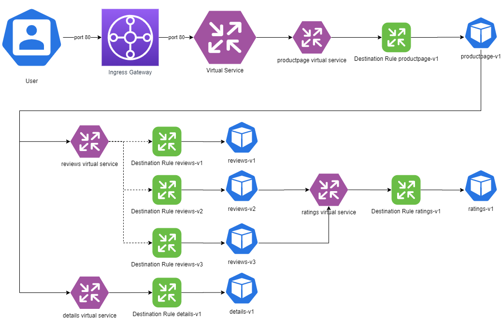
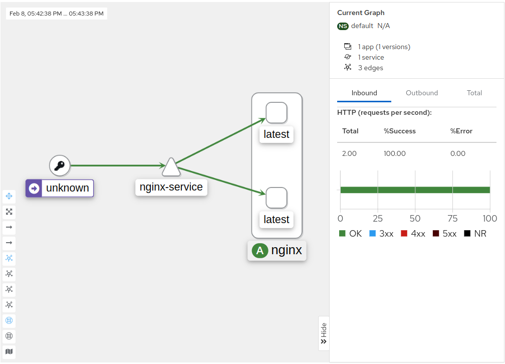

## Istio (Service Mesh)

### O que é Service Mesh
Service Mesh ou Malha de Serviço é uma camada extra adicionada ao seu cluster visando monitorar e modificar em tempo real o tráfego das aplicações, bem como elevar o nível de segurança e confiabilidade de todo ecossistema.

Os aplicativos modernos geralmente são arquitetados como coleções distribuídas de microsserviços, com cada coleção de microsserviços executando alguma função de negócios discreta. Uma malha de serviço é uma camada de infraestrutura dedicada que você pode adicionar aos seus aplicativos. Ele permite adicionar recursos de forma transparente, como observabilidade, gerenciamento de tráfego e segurança, sem adicioná-los ao seu próprio código. O termo “malha de serviço” descreve o tipo de software que você usa para implementar esse padrão e a segurança ou domínio de rede que é criado quando você usa esse software.

### O que é o Ístio?
Istio é um projeto open-source que implementa service mesh visando diminuir a complexidade no gerenciamento de aplicações distribuidas, independente de qual linguagem ou tecnologia foram desenvolvidas.

Os poderosos recursos do Istio fornecem uma maneira uniforme e mais eficiente de proteger, conectar e monitorar serviços. O Istio é o caminho para balanceamento de carga, autenticação serviço a serviço e monitoramento – com poucas ou nenhuma alteração no código de serviço. Seu poderoso plano de controle traz recursos vitais, incluindo:

- Comunicação segura de serviço a serviço em um cluster com criptografia TLS, autenticação e autorização fortes baseadas em identidade
- Balanceamento de carga automático para tráfego HTTP, gRPC, WebSocket e TCP
- Controle refinado do comportamento do tráfego com regras de roteamento avançadas, novas tentativas, failovers e injeção de falhas
- Uma camada de política conectável e uma API de configuração compatível com controles de acesso, limites de taxa e cotas
- Métricas, logs e rastreamentos automáticos para todo o tráfego em um cluster, incluindo entrada e saída do cluster

### Principais recursos
- Gerenciamento do tráfego
  - Gateways (entrada/ingress e saída/egress)
  - Load Balancing
  - Gerenciamento de Timeout
  - Políticas de retry
  - Circuit Breaker
  - Fault Injection
- Observabilidade
  - Métricas
  - Traces distribuidos
  - Logs
- Segurança
  - Man-in-the-middle
  - mTLS (Mutual TLS)
  - AAA (Authentication, Authorization and Audit) Triple A

### Arquitetura do Istio

#### Dinâmica && Sidecar Proxy
Ao adicionar um proxy "sidecar" junto com cada aplicativo implantado, o Istio permite que você programe gerenciamento de tráfego com reconhecimento de aplicativos, capacidade de observação incrível e recursos de segurança robustos em sua rede.


Uma malha de serviço do Istio é dividida logicamente em um **data plane** e um **control plane**.

O **data plane** é composto por um conjunto de proxies inteligentes (Envoy) implantados como sidecars. Esses proxies medeiam e controlam toda a comunicação de rede entre os microsserviços. Eles também coletam e relatam a telemetria em todo o tráfego de malha.

O **control plane** gerencia e configura os proxies para rotear o tráfego.

O diagrama a seguir mostra os diferentes componentes que compõem cada plano:


### Componentes
As seções a seguir fornecem uma breve visão geral de cada um dos principais componentes do Istio.

#### Envoy
O Istio usa uma versão estendida do proxy Envoy. O Envoy é um proxy de alto desempenho desenvolvido em C++ para mediar todo o tráfego de entrada e saída para todos os serviços na malha de serviço. Os proxies Envoy são os únicos componentes do Istio que interagem com o tráfego do plano de dados.

Os proxies Envoy são implantados como sidecars para serviços, aumentando logicamente os serviços com os muitos recursos integrados do Envoy, por exemplo:

- Dynamic service discovery
- Load balancing
- TLS termination
- HTTP/2 and gRPC proxies
- Circuit breakers
- Health checks
- Staged rollouts with %-based traffic split
- Fault injection
- Rich metrics

Essa implantação de sidecar permite que o Istio imponha decisões de política e extraia telemetria avançada que pode ser enviada a sistemas de monitoramento para fornecer informações sobre o comportamento de toda a malha.

O modelo de proxy sidecar também permite adicionar recursos do Istio a uma implantação existente sem a necessidade de reprojetar ou reescrever o código.

Alguns dos recursos e tarefas do Istio habilitados pelos proxies Envoy incluem:

- Recursos de controle de tráfego: reforce o controle de tráfego refinado com regras de roteamento avançadas para tráfego HTTP, gRPC, WebSocket e TCP.
- Recursos de resiliência de rede: novas tentativas de configuração, failovers, disjuntores e injeção de falhas.
- Recursos de segurança e autenticação: imponha políticas de segurança e controle de acesso e limitação de taxa definidos por meio da API de configuração.
- Modelo de extensões conectáveis baseado em WebAssembly que permite aplicação de política personalizada e geração de telemetria para tráfego de malha.

#### IstioD

O Istiod fornece descoberta de serviços, configuração e gerenciamento de certificados.

O Istiod converte regras de roteamento de alto nível que controlam o comportamento do tráfego em configurações específicas do Envoy e as propaga para os sidecars em tempo de execução. O Pilot abstrai os mecanismos de descoberta de serviços específicos da plataforma e os sintetiza em um formato padrão que qualquer sidecar em conformidade com a API do Envoy pode consumir.

O Istio pode oferecer suporte à descoberta de vários ambientes, como Kubernetes ou VMs.

Você pode usar a API de gerenciamento de tráfego do Istio para instruir o Istiod a refinar a configuração do Envoy para exercer um controle mais granular sobre o tráfego em sua malha de serviço.

A segurança do Istiod permite forte autenticação de serviço a serviço e de usuário final com identidade integrada e gerenciamento de credenciais. Você pode usar o Istio para atualizar o tráfego não criptografado na malha de serviço. Usando o Istio, as operadoras podem impor políticas com base na identidade do serviço, em vez de identificadores de rede relativamente instáveis da camada 3 ou da camada 4. Além disso, você pode usar o recurso de autorização do Istio para controlar quem pode acessar seus serviços.

O Istiod atua como uma autoridade de certificação (CA) e gera certificados para permitir a comunicação mTLS segura no plano de dados.

### Kiali - O Console para Istio Service Mesh
Configure, visualize, valide e solucione problemas de sua malha! Kiali é um console para malha de serviço Istio. O Kiali pode ser instalado rapidamente como um complemento do Istio ou confiável como parte de seu ambiente de produção. Veja abaixo mais sobre o que o Kiali oferece ou apenas comece!


### Instalação Istio

#### K3D
https://k3d.io/

k3d é um wrapper leve para executar k3s (distribuição Kubernetes mínima do Rancher Lab) no docker.

```bash
wget -q -O - https://raw.githubusercontent.com/k3d-io/k3d/main/install.sh | bash
```

Criando um novo Cluster
```bash
k3d cluster create -p "8000:30000@loadbalancer" --agents 2
```

```bash
kubectl config use-context k3d-k3s-default
```

#### Istio
https://istio.io/

Download
```bash
curl -L https://istio.io/downloadIstio | sh -
```

Install Istio
```bash
istioctl install --set profile=demo -y

#Adicione um rótulo de namespace para instruir o Istio a injetar automaticamente proxies secundários do Envoy quando você implantar seu aplicativo posteriormente
kubectl label namespace default istio-injection=enabled
```

```bash
kubectl get po -n istio-system

NAME                                    READY   STATUS    RESTARTS   AGE
istiod-66c575d5c5-6g65c                 1/1     Running   0          3m29s
istio-ingressgateway-7cf5c5849d-d75kr   1/1     Running   0          3m17s
istio-egressgateway-757bfb7888-v9xtd    1/1     Running   0          3m17s
```

```bash
kubectl get svc -n istio-system

NAME                   TYPE           CLUSTER-IP      EXTERNAL-IP   PORT(S)                                                                      AGE
istiod                 ClusterIP      10.43.15.202    <none>        15010/TCP,15012/TCP,443/TCP,15014/TCP                                        3m51s
istio-egressgateway    ClusterIP      10.43.151.183   <none>        80/TCP,443/TCP                                                               3m39s
istio-ingressgateway   LoadBalancer   10.43.122.189   <pending>     15021:30828/TCP,80:30784/TCP,443:31375/TCP,31400:30144/TCP,15443:30949/TCP   3m39s
```

```bash
> kubectl apply -f deployment.yaml

> kubectl get po
NAME                     READY   STATUS    RESTARTS   AGE
nginx-6d99f84b48-txshl   2/2     Running   0          22s

> kubectl describe po nginx-6d99f84b48-txshl
Events:
  Type     Reason     Age   From               Message
  ----     ------     ----  ----               -------
  Normal   Created    35s   kubelet            Created container istio-proxy
```

### Addons

#### Kiali
https://kiali.io/
https://github.com/istio/istio/tree/master/samples/addons

```bash
kubectl apply -f https://raw.githubusercontent.com/istio/istio/master/samples/addons/prometheus.yaml
kubectl apply -f https://raw.githubusercontent.com/istio/istio/master/samples/addons/kiali.yaml
kubectl apply -f https://raw.githubusercontent.com/istio/istio/master/samples/addons/jaeger.yaml
kubectl apply -f https://raw.githubusercontent.com/istio/istio/master/samples/addons/grafana.yaml
```

```bash
> kubectl get po -n istio-system

NAME                                    READY   STATUS    RESTARTS   AGE
istiod-66c575d5c5-6g65c                 1/1     Running   0          105m
istio-ingressgateway-7cf5c5849d-d75kr   1/1     Running   0          105m
istio-egressgateway-757bfb7888-v9xtd    1/1     Running   0          105m
prometheus-85949fddb-lp2wk              2/2     Running   0          43m
jaeger-76cd7c7566-xvnzt                 1/1     Running   0          118s
kiali-7d7df7458c-2wc28                  1/1     Running   0          2m6s
grafana-56bdf8bf85-z644q                1/1     Running   0          112s
```

Acesse o painel do Kiali.
```bash
istioctl dashboard kiali
```
### Gerenciamento de Tráfego com Istio


#### Ingress Gateway
- Recebe requisições externas
- Liberação de Portas, Certificados...
- Não é responsável por rotear o tráfego, isso é tarefa do Virtual Service

#### Virtual Service
Um Virtual Service permite você configurar como as requisições serão roteadas para um serviço. Ela possui uma série de regras que quando aplicadas farão com que a requisição seja direcionada ao destino correto.

- Não é o virtual service do Kubernetes, ambos são complementares
- Roteamento de tráfego
- Match de url
- Retries
- Fault Injection
- Timeout
- Subsets (v1 e v1) Categorias de destinos. **Subsets realizam o link entre as regras do virtual service com as configurações do destinations rules**
- Configura os proxies para ser possivel modificar o tráfego

#### Destination Rule
Você pode pensar nos virtual services como uma forma para rotear tráfego, e então você usa as **destination rules** para configurar o que acontece com o tráfego quando ele chega ao destino.

- Aplica configurações de tráfego de acordo com os Subsets
- Selector
- Mantem regras de Load Balancer
- Regras de Localidade (Locality)
- Circuit Breaker

#### Gateway
Gerencia a entrada e saída do tráfego. TRabalha nos layers 4-6, garantindo o gerenciamento de portas, e TLS. É conectado a um Virtual Service que será responsável pelo roteamento.

- Ingress - Tráfego de entrada
- Egress - Tráfego de saída

### Versões de Deployment
```bash
> kubectl apply -f deployment.yaml

> kubectl get po
NAME                       READY   STATUS    RESTARTS   AGE
nginx-b-7d8d5d8f49-wzds8   2/2     Running   0          32s
nginx-5b4595f479-g4dj7     2/2     Running   0          32s

> kubectl get svc
NAME            TYPE           CLUSTER-IP     EXTERNAL-IP                        PORT(S)          AGE
kubernetes      ClusterIP      10.43.0.1      <none>                             443/TCP          2d4h
nginx-service   LoadBalancer   10.43.40.173   172.23.0.2,172.23.0.3,172.23.0.4   8000:30000/TCP   54s

> while true; do curl http://localhost:8000; echo; sleep 0.5; done;
Full Cycle A
Full Cycle A
Full Cycle A
Full Cycle B
Full Cycle A
Full Cycle B
Full Cycle A
Full Cycle A
Full Cycle B
Full Cycle B
Full Cycle B
Full Cycle B
Full Cycle B
```



### Deploy canario com Istio

**Deployment Fortio**
https://istio.io/latest/docs/tasks/traffic-management/circuit-breaking/#adding-a-client
```bash
> kubectl apply -f https://raw.githubusercontent.com/istio/istio/release-1.16/samples/httpbin/sample-client/fortio-deploy.yaml

> export FORTIO_POD=$(kubectl get pods -l app=fortio -o 'jsonpath={.items[0].metadata.name}')

> kubectl exec "$FORTIO_POD" -c fortio -- fortio load -c 2 -qps 0 -t 200s -loglevel Warning http://nginx-service:8000
```

### Criando Virtual Service e Destination Rules

```bash
kubectl apply -f vs.yaml
kubectl apply -f dr.yaml
```

[vs.yaml](vs.yaml)
```yaml
apiVersion: networking.istio.io/v1alpha3
kind: VirtualService
metadata:
  name: nginx-vs
spec:
  hosts:
    - nginx-service
  http:
    - route:
      - destination:
          host: nginx-service
          subset: v1
        weight: 90

      - destination:
          host: nginx-service
          subset: v2
        weight: 10

```

[dr.yaml](dr.yaml)
```yaml
apiVersion: networking.istio.io/v1alpha3
kind: DestinationRule
metadata:
  name: nginx-dr
spec:
  host: nginx-service
  subsets:
    - name: v1
      labels:
        version: A
    - name: v2
      labels:
        version: B
```